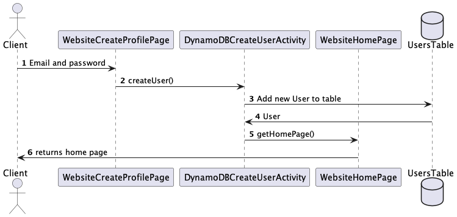
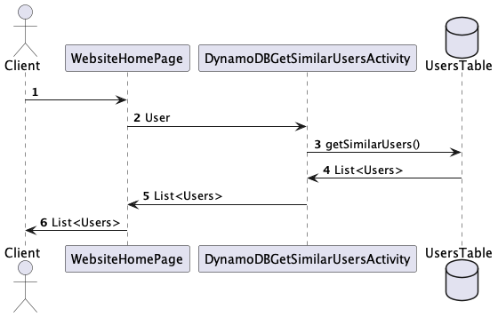
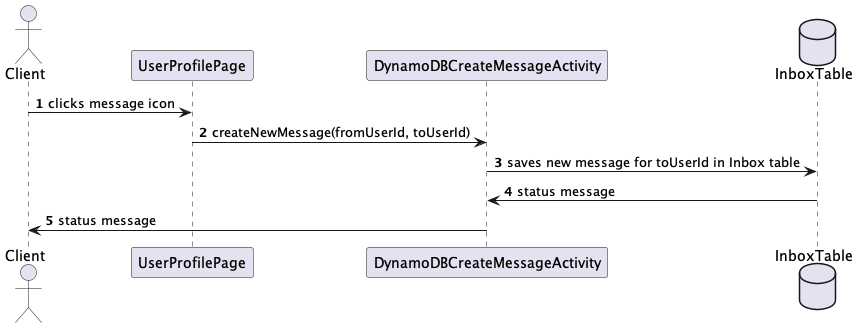
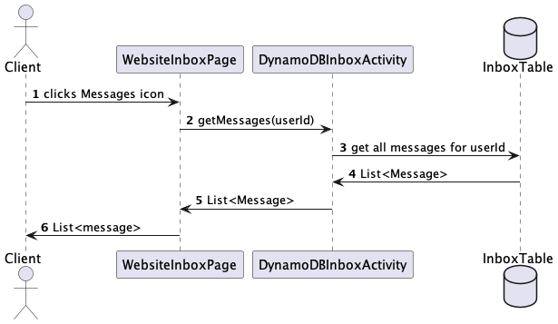
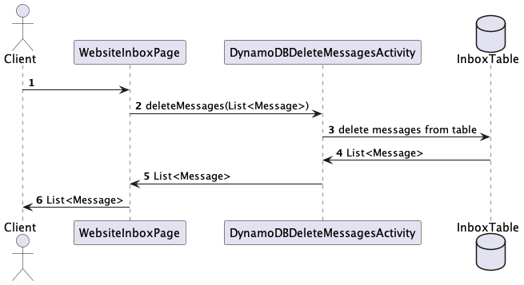
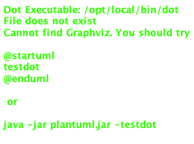
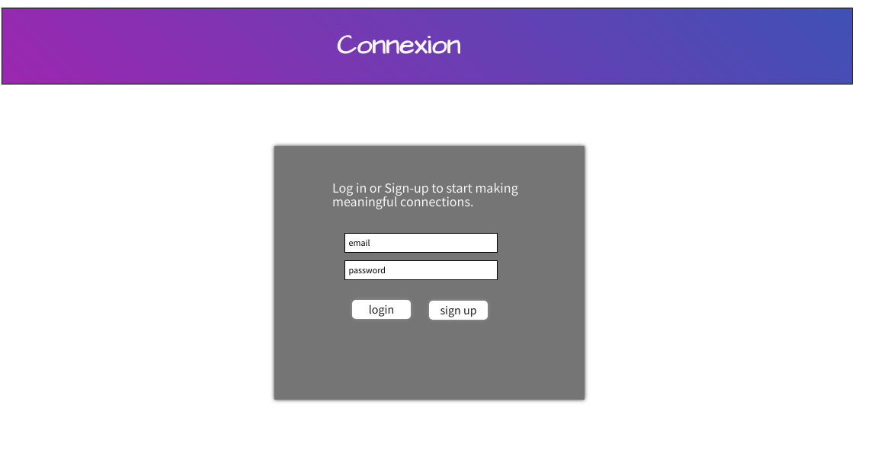

# Design Document

## Connexion Design

## 1. Problem Statement

There are many ways today in which we can connect with new people, but something is missing from the equation. 
People have a deep desire for genuine connection. Connexion is a service that matches users that are most compatible.
Customers have the ability to send an invitation to connect with the desired user(s) and, if the invitation is
accepted, can exchange messages.

---

## 2. Top Questions to Resolve in Review

_List the most important questions you have about your design, or things that you are still debating internally that 
 you might like help working through._

1. Should users be filtered by their set location or by their current location?
2. How should the issue of blank "about me" sections be dealt with?
3. 

---

## 3. Use Cases

<b>U1.</b> As a Connexion customer, I want to be able to create a profile containing information about me.

<b>U2.</b> As a Connexion customer, I want to be able to update my profile information.

<b>U3.</b> As a Connexion customer, I want to be able to view a list of the most compatible users within a certain 
           distance from me and that I have not previously connected with.

<b>U4.</b> As a Connexion customer, I want to be able to send connection invitations to other users.

<b>U5.</b> As a Connexion customer, I want to be able to receive connection invitations from other users.

<b>U6.</b> As a Connexion customer, I want to be able to send and receive private messages.

<b>7.</b> As a Connexion customer, I want to be able to delete private messages.

<b>U8.</b> As a Connexion customer, I want to be able to block specific users from contacting me.

<b>U9.</b> As a Connexion customer, I want to have the option to delete my profile.
 

---

## 4. Project Scope

_Clarify which parts of the problem you intend to solve. It helps reviewers know what questions to ask to make sure 
 you are solving for what you say and stops discussions from getting sidetracked by aspects you do not intend to handle
 in your design._

### 4.1. In Scope

* creating and updating a user profile
* returning a list of most compatible users that have not been previously connected with
* sending and receiving private messages
* deleting private messages


### 4.2. Out of Scope

* blocking a user
* Sending/receiving connection invitations
* invitations to connect expiring after 24 hours
* returning a list of most compatible users that have not been previously connected with and that have not been 
  declined an invitation to connect
* returning a list of most compatible users based on the user's current location

---

# 5. Proposed Architecture Overview

This initial iteration will provide the minimum lovable product (MLP) including creating and updating a user profile,
returning a list of most compatible users within a given distance, and the ability to send, receive, and delete
private messages.

We will use API Gateway and Lambda to create eight endpoints ('LogIn', 'CreateProfile', 'UpdateProfile', 'GetSimilarUsers', 
'CreateNewMessage', 'GetInboxMessages', and 'DeleteMessages') that will handle the creation and updating of user profiles,
the retrieval of most compatible users, the creation of new messages, the retrieval of received messages, and the 
deletion of messages to satisfy our requirements.

We will store user's and their profile information in a table in DynamoDB. Messages will also be stored in DynamoDB. 
For retrieval of users that have not previously been connected with, we will store connections of each user in the 
"Connections" table.

Connexion will also provide a web interface for users to manage their profile. A main page providing a list view of 
all the most compatible users will let them send private messages to the user(s) of their choosing. An inbox page will
provide a list view of all received messages. 

---

# 6. API

## 6.1. Public Models

```
// UserModel

String id;
String email;
String name;
String birthdate;
String location;
String profilePicture;
String personalityType;
List<String> hobbies;
List<String> connections;
```

```
// MessageModel

String id;
String sentBy;
String receivedBy;
String dateTimeSent;
String messageContents;
String readStatus;
```


## 6.2. Log In Endpoint

* Accepts `GET` request to `/users/:id`
* Accepts an email address and password and returns the user's profile.
* For security concerns, we will validate that the provided email is of the correct format and that the password
  is correct.
* If email address/password combination is incorrect, will throw `InvalidEmailPasswordCombinationException`


## 6.3. Create Profile Endpoint

* Accepts `POST` requests to `/users`
* Accepts data to create a new user profile with an id, a provided email, name, birthdate, location, about me, and an 
  optional personality type. Returns the new user, including a unique user ID assigned by the Connexion Service.
* For security concerns, we will validate the provided user information does not contain any invalid characters: 
  `" ' \`
* If information fields contain any of the invalid characters, will throw an `InvalidAttributeValueException`.
* If email address is already in use, will throw `ExistingAccountException`




## 6.4 Update Profile Endpoint

* Accepts `PUT` requests to `/users/:id`
* Accepts data to update a user profile, including an email address, name, birthdate, location, list of hobbies, and 
  optional personality type. Returns the updated user profile.
* If the user ID is not found, will throw a `UserNotFoundException`
* For security concerns, we will validate the provided user information does not contain any invalid characters:
  `" ' \`
* If information fields contain any of the invalid characters, will throw an `InvalidAttributeValueException`.


## 6.5 Get Similar Users Endpoint

* Accepts `GET` requests to `/users/:id/similar-users`
* Accepts a user ID and returns a list of most similar users.
    * If the optional `personalityType` parameter is provided, this API will 
      return the list of similar users filtered by most compatible personality
      types, based on the value of `personalityType`
        * Analysts:
          * INTJ
          * INTP
          * ENTJ
          * ENTP
        * Diplomats:
          * INFJ
          * INFP
          * ENFJ
          * ENFP
        * Sentinels:
          * ISTJ
          * ISFJ
          * ESTJ
          * ESFJ
        * Explorers:
          * ISTP
          * ISFP
          * ESTP
          * ESFP
* If the given user ID is not found, will throw a `UserNotFoundException`



## 6.6. Create New Message Endpoint

* Accepts `POST` requests to `/users/:id/inbox/sent`
* Accepts data to create a new private message, including a message ID, date and time sent, recipient, and message 
  content.
* If body of message is blank, will throw `EmptyMessageException`



## 6.7. Get Inbox Messages Endpoint

* Accepts `GET` request to `/users/:id/inbox`
* Accepts a user ID and returns a list of messages
* If a give user ID is not found, will throw `UserNotFoundException`




## 6.8 Delete Messages Endpoint

* Accepts `PUT` request to `users/:id/inbox`
* Accepts list of message IDs to delete, returns updated list of messages
* If a message ID is not found, will throw `MessageNotFoundException`


---

# 7. Tables

### 7.1. `users`

```
id // partition key, string
name // string
email // string
birthdate // string
location // string
profilePicture // string
personalityType // string
hobbies // stringSet
connections // stringSet
```

### 7.2. `inbox`

```
messageId // partition key, string
dateTimeSent // string
sentBy // string
receivedBy // string
messageContent // string
readStatus // boolean
```

---

# 8. Class Diagram

---
# 9. Pages





